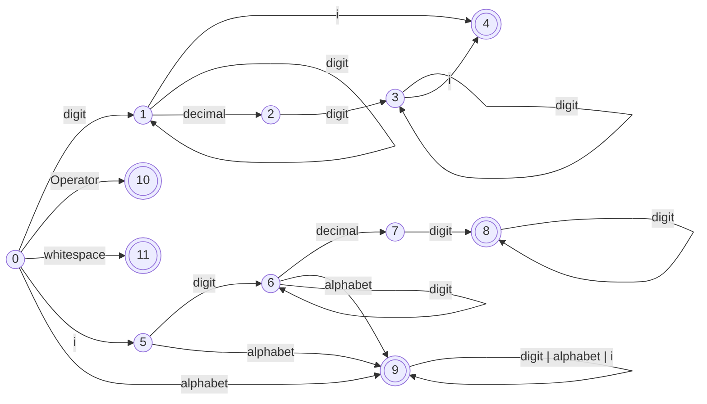

# ComplexPlane
ComplexPlane is a compiler, which compiles equations of complex numbers, and displays the resultant transformation in a 2D grid.


## Lexer
The following represents the DFA ( Deterministic Finite Automaton ) which is used to convert incoming stream of characters into tokens representing complex number, identifier or an operator.



## Parser
The following are the production rules.
```
M -> id = X
X -> -E | E
E -> E+T | E-T
T -> T*F | T/F
F -> id | real | imaginary | (X) 
```
After removing left recursion for LL(1) parser
```
M -> id = X
X -> -E | E
E -> TE"
E" -> +TE" | -TE" | e
T -> FT"
T" -> *FT" | /FT" | e
F -> id | real | imaginary | (X)
```

## Predictive Parsing Table
Since LL(1) grammar was used, the production rules are modified to eliminate left recursion
| | id | $ | imaginary | real | + | - | * | / | ( | ) |
|---|---|---|---|---|---|---|---|---|---|---|
| M | M -> id=X | | | | | | | | | | 
| X | X -> E | | X -> E | X -> E | | X -> -E | | | X -> E | |
| E | E -> TE" | | E -> TE" | E -> TE" | | | | | E -> TE" | |
| E" | | E" -> e | | | E" -> +TE" | E" -> -TE" | | | | E" -> e | 
| T | T -> FT" | | T -> FT" | T -> FT" | | | | | T -> FT" | |
| T" | | T" -> e | | | T" -> e | T" -> e | T" -> *FT" | T" -> /FT" | | T" -> e |
| F | F -> id | | F -> imaginary | F -> real | | | | | F -> (X) | |

    
## How to use
This program currently works on Linux systems only.
Program will open a seperate 'Complex Plane window' displaying the complex plane.
You will write the equations in console window from where you launched the program, and see the output of equation in the 'Complex Plane window'.\
You need to specify a variable for the grid first. Let it be z, the you can tell the program that you want to write equation using variable z
```
equation z
```
Then you can start writing your equation, make sure to end equation with ! (exclamation mark). Hit enter and see transformation. For example:
```
equation z
   y = 2+3i
   z = y * z
   !
```

## Controls
Following keyboard shortcuts works when 'Complex Plane window' is focused
* Restart the animation by pressing r
* Zoom in by pressing z
* Zoom out by pressing shift+z

## Examples
Here are some example equations with their transformations
```
 equation z
    y = (z*z)/100
    z = y*z*y
    !
```


```
equation z
   rot45 = 0.7072 + i0.7072
   inv = rot45/z
   z = inv*100
   !
```


